# LAPORAN PROGRESS RISET: TAHAP 1 HINGGA TAHAP 2
## Proyek UTS Data Mining — Analisis Karakteristik Data Sensor Geotermal Multivariat & Pemodelan Klasterisasi Deret Waktu

---

**Program Studi :** S1 Teknik Informatika, Universitas Padjadjaran  
**Mata Kuliah   :** Data Mining (Semester 5)  
**Judul Riset   :** *Impact of Feature Scaling and Temporal Window Aggregation on Multivariate Geothermal Drilling Sensor Clustering Using K-Means*  
**Judul (ID)    :** *Analisis Pengaruh Penskalaan dan Agregasi Jendela Waktu terhadap Klasterisasi Delapan Sensor Pemantau Pemboran Geotermal Menggunakan K-Means*  
**Tim Peneliti  :**  
1. Aulia Fadhila Mumtaza  
2. Fathan Ariiq Rasbi Yalis  
3. Aliya Zahra Nurazizah  
4. Achmad Faruq Mahdison  
5. M. Rafif Widyadhana  
**Target Luaran :** Naskah Ilmiah Format IEEE Conference 2-Kolom (5–8 Halaman), Pipeline Kode Reproducibel, dan Dataset Siap Model (*Modeling-Ready*)  
**Dataset Acuan :** Utah FORGE Well 56-32 (*High-Frequency 1 Hz Surface Pason EDR Rig Sensors*, 2.506.359 baris mentah, durasi 29 hari operasi)  

---

## DAFTAR ISI PROGRESS
1. [Ringkasan Eksekutif & Linimasa Proyek](#1-ringkasan-eksekutif--linimasa-proyek)
2. [Latar Belakang Domain & Tiga Penyakit Utama Dataset](#2-latar-belakang-domain--tiga-penyakit-utama-dataset)
3. [Rekapitulasi Tahap 1: Tinjauan Literatur Sistematis (PRISMA 2020) & Gap Analysis](#3-rekapitulasi-tahap-1-tinjauan-literatur-sistematis-prisma-2020--gap-analysis)
   - 3.1 [Perumusan 4 Pertanyaan Penelitian (Research Questions)](#31-perumusan-4-pertanyaan-penelitian-research-questions)
   - 3.2 [Rancangan Search Query 4-Pilar Scopus](#32-rancangan-search-query-4-pilar-scopus)
   - 3.3 [Diagram Alir & Aritmetika Kuantitatif PRISMA 2020 (Terkunci)](#33-diagram-alir--aritmetika-kuantitatif-prisma-2020-terkunci)
   - 3.4 [Sintesis 9 Paper Inti Acuan & Pemetaan Posisi Riset (Gap Analysis)](#34-sintesis-9-paper-inti-acuan--pemetaan-posisi-riset-gap-analysis)
4. [Rekapitulasi Tahap 2: Data Understanding, Pra-Pemrosesan & Rekayasa Fitur](#4-rekapitulasi-tahap-2-data-understanding-pra-pemrosesan--rekayasa-fitur)
   - 4.1 [Taksonomi Sensor Berbasis 4 Subsistem Fisik Rig](#41-taksonomi-sensor-berbasis-4-subsistem-fisik-rig)
   - 4.2 [Audit Statistik Deskriptif & Temuan Fenomena Lapangan](#42-audit-statistik-deskriptif--temuan-fenomena-lapangan)
   - 4.3 [Evaluasi Multikolinearitas & Fisika Kopling Rig (Pearson vs Spearman)](#43-evaluasi-multikolinearitas--fisika-kopling-rig-pearson-vs-spearman)
   - 4.4 [Eksekusi 5 Langkah Pipeline Pra-Pemrosesan Data](#44-eksekusi-5-langkah-pipeline-pra-pemrosesan-data)
   - 4.5 [Rekayasa Deret Waktu: Gap-Aware Sliding Window (Bonus Track UTS)](#45-rekayasa-deret-waktu-gap-aware-sliding-window-bonus-track-uts)
5. [Inventarisasi Berkas Luaran & Artefak yang Telah Selesai](#5-inventarisasi-berkas-luaran--artefak-yang-telah-selesai)
6. [Kesiapan & Rencana Kerja Tahap 3 (Pemodelan & Evaluasi)](#6-kesiapan--rencana-kerja-tahap-3-pemodelan--evaluasi)

---

## 1. RINGKASAN EKSEKUTIF & LINIMASA PROYEK

Laporan perkembangan ini mendokumentasikan hasil kerja sistematis kelompok dari **Tahap 1 (Literature Review & Gap Analysis)** hingga penyelesaian tuntas **Tahap 2 (Data Understanding, Preprocessing Pipeline, & Time-Series Feature Engineering)**. 

Proyek ini mengeksplorasi tantangan klasterisasi *unsupervised* pada **2,5 juta baris data sensor berkecepatan tinggi (1 Hz)** dari rig pengeboran sumur panas bumi Utah FORGE Well 56-32. Formasi batuan granit kristalin keras (*Enhanced Geothermal Systems* / EGS) dan dinamika pengoperasian mesin derek menimbulkan anomali fisik kompleks yang tidak dapat diselesaikan oleh metode penambangan data standar.

```
┌────────────────────────────────────────────────────────────────────────────────────────────────────────┐
│                                   LINIMASA PROGRESS RISET DATA MINING                                  │
├─────────────────────────────────────────────────┬──────────────────────────────────────────────────────┤
│ TAHAP 1: LITERATURE REVIEW & PRISMA 2020        │ TAHAP 2: DATA UNDERSTANDING & PREPROCESSING PIPELINE │
│ [STATUS: SELESAI & TERKUNCI]                    │ [STATUS: SELESAI & 100% MODELING-READY]              │
├─────────────────────────────────────────────────┼──────────────────────────────────────────────────────┤
│ • Identifikasi 3 "penyakit" dataset 56-32       │ • Taksonomi 8 sensor ke dalam 4 subsistem fisik      │
│ • Perumusan 4 Research Questions (RQ1–RQ4)      │ • Audit univariat: Skewness +34, Kurtosis 2.867      │
│ • Pencarian Scopus 4-pilar: 740 RAW -> 175 OA   │ • Bukti korelasi: Kopel hidraulik r=0.925            │
│ • Screening manual (Pass-1 & Pass-2)            │ • Eliminasi sensor mati (Gas & Gamma 100% -999.25)   │
│ • Inklusi 9 Paper Inti + 7 Paper Cadangan       │ • Filter baris sentinel SPP <= -900 (29.503 baris)   │
│ • Pemetaan Gap Analysis terhadap studi dunia    │ • Isolasi metadata kedalaman (cegah spurious cluster)│
│ • Penyusunan Bab I & II Draft Paper IEEE        │ • Drop Differential Pressure (anomali -5.138 psi)    │
│                                                 │ • Rekayasa 4 fitur fisik rig baru                    │
│                                                 │ • Gap-Aware Sliding Window 60s (Kompresi 60x lipat)  │
└─────────────────────────────────────────────────┴──────────────────────────────────────────────────────┘
```

> [!NOTE]
> Seluruh kriteria penugasan UTS dan syarat nilai bonus telah dipenuhi:
> 1. Dataset multivariat kontinu ($\ge 5$ atribut numerik terbukti ada 8 sensor aktif).
> 2. Disparitas skala masif ($258,9 : 1$) terjustifikasi secara matematis dan fisik.
> 3. Sifat data murni tanpa label (*unlabeled*) untuk *unsupervised regime discovery*.
> 4. **Poin Bonus UTS:** Karakteristik ketergantungan deret waktu (*time-series temporal dependency*) ditangani secara eksplisit melalui algoritma *Gap-Aware Sliding Window* $W=60\text{s}$.

---

## 2. LATAR BELAKANG DOMAIN & TIGA PENYAKIT UTAMA DATASET

### 2.1 Konteks Operasional Rig Pengeboran Geotermal
Pengeboran sumur panas bumi (*geothermal well*) pada proyek Utah FORGE menembus batuan granit kristalin basement dengan kekerasan ekstrem pada temperatur tinggi. Operasi ini menelan biaya sewa rig puluhan ribu dolar per hari. Efisiensi operasi rig bergantung pada pemantauan telemetri permukaan secara kontinu. Namun, pencatatan log status rig (*rig states*) oleh operator manusia sering kali:
1. Terlambat dicatat (*human latency*),
2. Bersifat subjektif dan rentan salah tafsir antar-grup kru (*inconsistency*),
3. Tidak kontinu pada interval per detik (*coarse-grained*).

Oleh karena itu, diperlukan pendekatan penambangan data berbasis **klasterisasi tanpa label (*unsupervised operational regime discovery*)** untuk membedakan fase kerja rig secara otomatis.

### 2.2 Tiga "Penyakit" Utama Dataset Utah FORGE Well 56-32

Audit awal terhadap 2.506.359 baris data 1 Hz mengungkap 3 patologi teknis yang melandasi perumusan masalah:

1. **Penyakit 1: Ketimpangan Skala Ekstrem (*Extreme Scale Disparity*)**
   - Tekanan pompa fluida (*Standpipe Pressure* / SPP) beroperasi pada rentang ribuan psi (rata-rata $1.209\text{ psi}$, maksimum $5.298\text{ psi}$), sedangkan Torsi Putaran (*Rotary Torque*) hanya berfluktuasi pada angka satuan (rata-rata $2,15\text{ kft}\cdot\text{lb}$, maksimum $48,8\text{ kft}\cdot\text{lb}$).
   - **Rasio Rentang Skala:** **$258,9 : 1$** (Rentang ROP $10.771\text{ ft/hr}$ vs Rentang Torque $41,6\text{ kft}\cdot\text{lb}$).
   - **Dampak Matematis:** Rumus jarak Euclidean $d^2 = \sum (x_i - y_i)^2$ akan didominasi secara mutlak ($>95\text{--}99\%$) oleh kuadrat tekanan SPP. Seluruh sensor mekanik pemotongan batuan (WOB, RPM, Torsi) akan terabaikan oleh algoritma K-Means. Fenomena ini disebut **"Euclidean Collapse"**.

2. **Penyakit 2: Ketergantungan Temporal Sangat Kuat (*High Temporal Autocorrelation*)**
   - Data dicatat pada frekuensi 1 data per detik (1 Hz). Koefisien autokorelasi lag-1 bernilai mendekati sempurna: $\text{SPP} = 1,000$, $\text{RPM} = 0,999$, dan $\text{ROP} = 0,988$.
   - **Dampak Matematis:** Pemodelan konvensional *point-based* (memperlakukan baris detik secara independen) mengabaikan konteks transisi mekanis dan memicu **"chattering / flickering effect"**, yaitu label klaster berganti-ganti secara liar tiap detik pada kondisi fisik mesin yang sebenarnya stabil.

3. **Penyakit 3: Nilai Sentinel Sistemik & Pencilan Tarikan Derek (*Systemic Sentinels & Mechanical Outliers*)**
   - **Kode Sentinel Pason (`-999.25`):** Vendor Pason EDR menggunakan nilai baku `-999.25` untuk menandai sensor mati atau kabel telemetri dicabut. Kolom `Pason Gas` dan `Gamma` bernilai `-999.25` pada 100% baris (*null hardware*). Sementara itu, sensor SPP mencatat 29.503 baris (1,18%) bernilai $\le -900\text{ psi}$ saat seluruh sensor lain serentak mati (*systemic offline outage*).
   - **Lonjakan Tarikan Derek ROP (*Drawworks Spike*):** Penetrasi bor normal di granit berkisar antara $20\text{--}150\text{ ft/hr}$. Namun, data merekam lonjakan sesaat hingga **$11.145,94\text{ ft/hr}$** dengan kurtosis masif **$2.867,61$** dan skewness **$+34,00$**. Lonjakan ini bukan batuan yang ditembus, melainkan blok derek (*drawworks*) yang menarik rangkaian pipa ke atas dengan cepat saat proses penyambungan di udara.
   - **Anomali Turunan `Differential Pressure`:** Memiliki nilai minimum $-5.138\text{ psi}$ dan rata-rata $-692\text{ psi}$ (negatif). Anomali ini adalah cacat algoritma software rig yang mengurangkan angka 0 dengan acuan lama saat pompa lumpur dimatikan.

---

## 3. REKAPITULASI TAHAP 1: TINJAUAN LITERATUR SISTEMATIS (PRISMA 2020) & GAP ANALYSIS

### 3.1 Perumusan 4 Pertanyaan Penelitian (Research Questions)
Untuk memandu penelusuran literatur ilmiah, dirumuskan 4 pertanyaan teknis:
* **RQ1 (Penskalaan):** Metode penskalaan (*feature scaling*) apa yang terbukti paling tangguh terhadap pencilan mekanik dan disparitas skala tanpa merusak rasio variasi fisik sensor?
* **RQ2 (Deret Waktu / Bonus UTS):** Bagaimana mengekstrak informasi deret waktu dari jutaan baris sensor 1 Hz agar karakteristik temporal terjaga dengan efisiensi komputasi tinggi?
* **RQ3 (Pembersihan Data):** Bagaimana literatur membersihkan artefak transien mekanik dan menangani nilai sentinel sistemik telemetri rig?
* **RQ4 (Klasterisasi & Evaluasi):** Bagaimana arsitektur algoritma klasterisasi *unsupervised* memetakan rezim rig serta menentukan jumlah klaster optimal ($k$) menggunakan metrik validasi internal (Silhouette & Davies-Bouldin)?

### 3.2 Rancangan Search Query 4-Pilar Scopus
Pencarian literatur dilakukan pada basis data Scopus dengan memadukan 4 blok konsep:

```text
TITLE-ABS-KEY(
  /* Blok 1: Domain Pengeboran & Panas Bumi */
  (geothermal OR drill* OR wellbore* OR borehole* OR rig OR "rate of penetration" 
   OR "weight on bit" OR "rig state*" OR petro* OR "oil and gas")
  AND
  /* Blok 2: Karakteristik Data Deret Waktu Sensor */
  ("time series" OR "time-series" OR temporal OR multivariate OR sensor* 
   OR "sensor data" OR "sensor signal*" OR "high-frequency" OR unlabeled)
  AND
  /* Blok 3: Metodologi Klasterisasi & Penemuan Pola */
  (clust* OR "k-means" OR "k means" OR "fuzzy c-means" OR DBSCAN OR GMM 
   OR "gaussian mixture" OR "k-shape*" OR "pattern recognition" OR "anomaly detection")
  AND
  /* Blok 4: Pra-Pemrosesan & Rekayasa Fitur */
  (normali* OR scal* OR preprocess* OR "feature extraction" OR "feature engineering" 
   OR "sliding window*" OR outlier* OR denoising)
)
```

### 3.3 Diagram Alir & Aritmetika Kuantitatif PRISMA 2020 (Terkunci)

Proses penyeleksian literatur dijalankan secara manual (*spreadsheet-based*, tanpa Rayyan) mengikuti protokol PRISMA 2020 dengan aritmetika kuantitatif yang terkunci rapat:

```mermaid
flowchart TD
    A["<b>IDENTIFICATION</b><br/>Hasil Pencarian Luas Scopus (Q-RAW)<br/><b>n = 740 rekaman</b>"] --> B["Filter Formal Scopus:<br/>LIMIT-TO Open Access, Journal, English, Article<br/><i>(565 rekaman dikeluarkan)</i>"]
    B --> C["Kumpulan Data Awal Tersaring (Q-FILTERED)<br/><b>n = 175 rekaman</b><br/><i>(Duplikat = 0, Otomasi = 0)</i>"]
    C --> D["<b>SCREENING JUDUL & ABSTRAK</b><br/>Eksklusi Publikasi Usang (&le; 2020):<br/><b>n = 48 rekaman</b>"]
    D --> E["Sisa Naskah Dievaluasi (Pass-1):<br/><b>n = 127 rekaman</b>"]
    E --> F["Eksklusi Pass-1 Judul & Abstrak:<br/><b>n = 57 rekaman</b><br/>• E1 (Off-topic non-transferable) = 21<br/>• E2 (Bukan data deret waktu sensor) = 20<br/>• E3 (Tanpa relevansi metode & domain) = 16"]
    F --> G["<b>RETRIEVAL & ELIGIBILITY</b><br/>Naskah Lengkap Dicari (Sought):<br/><b>n = 70 rekaman</b><br/>(Batch-1 Langsung: 28 | Batch-2 Standby: 42)"]
    G --> H["Naskah Batch-1 Tidak Dapat Diunduh (E5):<br/><b>n = 4 rekaman</b> <i>(Link OA rusak/gateway error)</i>"]
    H --> I["Naskah Lengkap Dinilai (Full-Text Assessed):<br/><b>n = 25 rekaman</b><br/>(24 dari Batch-1 + 1 dari Batch-2 No.161)"]
    I --> J["Eksklusi Pass-2 Naskah Lengkap:<br/><b>n = 16 rekaman</b><br/>• E3 (No clustering relevance) = 4<br/>• E2 (Not sensor time-series) = 2<br/>• E4 (No preprocessing detail) = 2<br/>• E1 (Confirmed off-topic) = 1<br/>• Cadangan Terverifikasi (Backup) = 7"]
    J --> K["<b>INCLUSION (HASIL AKHIR)</b><br/>Studi Terpilih Memenuhi Kriteria:<br/><b>n = 9 Paper Inti Utama</b><br/><i>(+ 7 Paper Cadangan Standby)</i>"]
```



> [!IMPORTANT]
> **Verifikasi Aritmetika Kotak PRISMA:**
> - $740 \text{ (Raw)} - 565 \text{ (Filter Scopus)} = 175 \text{ (Q-Filtered)}$
> - $175 - 48 \text{ (Older than 2021)} = 127 \text{ (Pass-1 Pool)}$
> - $127 - 57 \text{ (Excluded Pass-1)} = 70 \text{ (Reports Sought)}$
> - $70 \text{ Sought} = 28 \text{ (Batch-1)} + 42 \text{ (Batch-2 Standby)}$
> - $28 \text{ (Batch-1)} - 4 \text{ (E5 Broken Links)} = 24 \text{ (Assessed Batch-1)}$
> - $24 \text{ (Batch-1)} + 1 \text{ (Batch-2 No.161)} = 25 \text{ (Total Assessed)}$
> - $25 \text{ Assessed} - 16 \text{ Excluded Pass-2} = \mathbf{9\text{ Paper Inti Inklusi Final}}$ *(Target tugas $\ge 8$ terlampaui!)*

### 3.4 Sintesis 9 Paper Inti Acuan & Pemetaan Posisi Riset (Gap Analysis)

| No | Paper Acuan & Sumber | Dataset & Karakter | Metode Preprocessing | Algoritma Klasterisasi | Metrik Evaluasi | Celah Riset (*Gap*) & Posisi Kelompok Kita |
|:--:|---|---|---|---|---|---|
| **1** | **Abrasaldo et al. (2026)**<br/>*Geothermics* (Elsevier) | Data temperatur & laju aliran PLTP Wairakei | Seleksi fitur self-supervised 13 dari 1588 fitur | Komparasi 9 algoritma (K-Means, GMM, DBSCAN, dll.) | Silhouette ($0,66$), DBI ($0,40$) | **GAP:** Fokus pada fasilitas geotermal tunggal tanpa studi perbandingan penskalaan (*scaling*) dan jendela waktu. Kita: 8 sensor rig + evaluasi interaksi scaler $\times$ window. |
| **2** | **Li et al. (2026)**<br/>*PLOS ONE* | 7.231 sampel 4 sumur (WOB, RPM, Torque, Flow, ROP) | Imputasi RF, fusi LOF/K-Means, Savitzky-Golay, *sliding window* | Random Forest (Supervised Parameter Optimization) | RMSE, Akurasi ROP | **GAP:** Bersifat optimasi terarah (*supervised*). Kita: *Unsupervised operational regime discovery* tanpa label. |
| **3** | **Singh et al. (2026)**<br/>*Frontiers in AI* | 12 log sensor trajektori sumur pemboran | Interpolasi, normalisasi min-max, window panjang 50 | GNN + LSTM Autoencoder Unsupervised | Reconstruction Error, AUC, F1 | **GAP:** Berbasis deret kedalaman (*depth-series*). Kita: Mengolah deret waktu permukaan 1 Hz resolusi tinggi. |
| **4** | **Mohammed et al. (2025)**<br/>*Int. J. Crit. Infrastruct. Prot.* | Jejak paket jaringan industri migas (ICPS) | *Sliding time-window* + ekstraksi periodisitas | STADe vs KNN, Isolation Forest, LOF | F1-Score ($0,97$), FPR nol | **GAP:** Menggunakan data paket siber jaringan. Kita: Mengolah sinyal fisik sensor mekanik dan hidraulik mesin rig. |
| **5** | **Azuma & Hashimoto (2025)**<br/>*Engineering Proceedings* | Produksi uap 9 sumur geotermal (14 tahun) | Filter Butterworth, Singular Spectrum Analysis (SSA) | Deteksi anomali SSA via *Lagged Trajectory Matrix* | F1-Score, ROC-AUC | **GAP:** Analisis univariat satu sensor uap. Kita: Pemodelan multivariat simultan 8 sensor rig pengeboran. |
| **6** | **Bayazitova et al. (2024)**<br/>*Geoenergy Sci. & Eng.* | Benchmark 3W Petrobras 21 sumur lepas pantai | Forward-fill, standardisasi, downsampling 1 mnt, window 30 | Deep Neural Networks (DNN) Klasifikasi Aliran | F1-Score ($0,97$) | **GAP:** Bergantung pada label supervisi ahli yang mahal. Kita: Klasterisasi murni tanpa label data lapangan. |
| **7** | **Wang et al. (2026)**<br/>*Energy Explor. & Exploit.* | Profil produksi 189 sumur serpih Permian | Normalisasi skala atribut, seleksi fitur MRMR, MDS | Klasterisasi Unsupervised (K-Means), Elbow $k=2$ | Elbow, Calinski-Harabasz | **GAP:** Menggunakan fitur statis agregat bulanan. Kita: Deret waktu dinamis resolusi tinggi (1 detik) dengan jendela geser. |
| **8** | **Nakano et al. (2023)**<br/>*J. Adv. Mech. Des. Sys.* | Emisi akustik (AE) mesin bor industri | Transformasi CWT, ekstraksi fitur frekuensi-waktu | DDM MVG vs CAE Anomaly Segmentation | Peta anomali segmentasi | **GAP:** Skala laboratorium mikro dengan sensor tunggal. Kita: Rig pengeboran geotermal skala penuh di lingkungan lapangan ekstrem. |
| **9** | **Hadiyeva et al. (2026)**<br/>*SOCAR / Satbayev Univ.* | $>3$ juta entri data 2 tahun harian sumur migas | Normalisasi Z-score, eliminasi pencilan, korelasi | K-Means Clustering, kurva Elbow $k=10$ | Inertia Elbow, Stabilitas Klaster ($70\%$) | **GAP:** Agregasi harian makro tanpa analisis pengaruh scaler. Kita: Komparasi empiris StandardScaler vs RobustScaler pada data frekuensi tinggi 1 Hz. |

---

## 4. REKAPITULASI TAHAP 2: DATA UNDERSTANDING, PRA-PEMROSESAN & REKAYASA FITUR

### 4.1 Taksonomi Sensor Berbasis 4 Subsistem Fisik Rig
Dari 22 kolom awal, dilakukan pemetaan taksonomi ke dalam 4 subsistem fungsional rig pemboran geotermal:

```
                               TAKSONOMI SENSOR RIG WELL 56-32
                                               │
       ┌───────────────────────┬───────────────┴───────────────┬───────────────────────┐
       ▼                       ▼                               ▼                       ▼
[MEKANIK BATUAN]       [SIRKULASI HIDRAULIK]           [DEREK & PENGANGKAT]    [GEOMETRI LUBANG BOR]
• ROP (ft/hr)          • SPP (psi)                     • Hook Load (klbs)      • Hole Depth (ft)
• WOB (klbs)           • Pump Output (GPM)             • Block Height (ft)     • Bit Depth (ft)
• Rotary RPM           • Flow Out Return (%)                                   • Lag Depth (ft)
• Torque (kft-lb)
```

1. **Subsistem Mekanik Batuan (*Rock Destruction*):** Parameter langsung interaksi pahat bor dengan formasi batuan granit (ROP, WOB, RPM, dan Rotary Torque).
2. **Subsistem Sirkulasi Hidraulik (*Fluid Circulation*):** Parameter penyemprotan lumpur pendingin dan pembersih serpihan batuan (Standpipe Pressure, Total Pump Output, dan persentase aliran balik Flow Out Return).
3. **Subsistem Derek & Pengangkat (*Hoisting System*):** Parameter penahan beban gantung dan pemindahan pipa (Hook Load dan ketinggian traveling block Block Height).
4. **Subsistem Geometri & Posisi Lubang Bor:** Catatan kedalaman dan referensi profil vertikal (Hole Depth, Bit Depth, dan Lag Depth).

### 4.2 Audit Statistik Deskriptif & Temuan Fenomena Lapangan
Audit dilakukan terhadap $2.476.856$ baris data bersih valid untuk mengungkap parameter pemusatan, dispersi, dan bentuk distribusi:

| Subsistem | Parameter Sensor | Satuan | Mean | Std Dev | Median | IQR | Min | Max | Kemencengan (*Skew*) | Keruncingan (*Kurtosis*) |
|---|---|:---:|:---:|:---:|:---:|:---:|:---:|:---:|:---:|:---:|
| **Mekanik** | Rate Of Penetration (ROP) | ft/hr | 25,43 | 98,71 | 0,00 | 19,18 | 0,00 | 11.145,94 | **+34,00** | **2.867,61** |
| **Mekanik** | Weight on Bit (WOB) | klbs | 19,07 | 28,97 | 0,00 | 41,70 | 0,00 | 192,00 | **+1,97** | **10,51** |
| **Mekanik** | Rotary RPM | RPM | 16,47 | 28,01 | 0,03 | 39,28 | 0,00 | 113,79 | **-8,71** | **342,20** |
| **Mekanik** | Rotary Torque | kft$\cdot$lb | 1,97 | 14,55 | 0,00 | 4,54 | 0,00 | 48,81 | **-64,55** | **4.440,63** |
| **Hidraulik** | Standpipe Pressure (SPP) | psi | 1.210,30 | 1.489,35 | 0,00 | 3.006,68 | 0,00 | 5.298,75 | **+0,54** | **-1,55** |
| **Hidraulik** | Total Pump Output | gal/min | 258,11 | 311,81 | 0,00 | 660,66 | 0,00 | 1.772,77 | **+0,57** | **-1,41** |
| **Hidraulik** | Flow Out Return | % | 28,94 | 65,09 | 6,82 | 67,89 | 0,00 | 134,43 | **-11,12** | **174,58** |
| **Derek** | Hook Load | klbs | 93,53 | 60,92 | 66,60 | 100,80 | 0,00 | 392,10 | **+0,68** | **-0,05** |
| **Derek** | Block Height | feet | 70,27 | 43,29 | 65,00 | 66,70 | 0,00 | 194,30 | **+0,36** | **+1,21** |
| **Proksi Daya** | Hydraulic Energy Proxy | psi$\cdot$GPM | 741.534 | 990.377 | 0,00 | 1.989.393 | 0,00 | 6.444.095 | **+0,77** | **-1,11** |
| **Proksi Daya** | Mechanical Power Proxy | kft$\cdot$lb$\cdot$RPM | 100,90 | 192,18 | 0,00 | 154,61 | 0,00 | 2.612,68 | **+2,69** | **+8,95** |
| **Posisi** | Delta Depth | feet | 1.923,56 | 2.947,07 | 40,50 | 3.231,00 | 0,00 | 9.145,00 | **+1,28** | **+0,05** |
| **Posisi** | Is_On_Bottom | biner | 0,34 | 0,47 | 0,00 | 1,00 | 0,00 | 1,00 | **+0,69** | **-1,52** |

#### Tiga Wawasan Kritis Berdasarkan Audit Statistik:
1. **Bukti Kegagalan Asumsi Normalitas (Extreme Fat-Tail):** Nilai Kurtosis ROP ($2.867,61$) dan skewness ($+34,00$) membuktikan ekor distribusi yang luar biasa tebal akibat lonjakan tarikan derek ($11.145\text{ ft/hr}$). Hal ini mendiskualifikasi asumsi kurva lonceng normal pada `StandardScaler`.
2. **Karakteristik Bimodal Operasional:** Sensor hidraulik (SPP dan Pump Output) menunjukkan kurtosis negatif ($-1,4$ hingga $-1,5$). Hal ini merefleksikan dua modus fisik alami rig: mode mati saat cabut-sambung pipa (*connection*) dan mode bertekanan tinggi saat sirkulasi atau pengeboran aktif.
3. **Median Nol pada 5 Sensor Utama:** Menandakan bahwa rig menghabiskan porsi waktu yang besar dalam status *idle / connection*, sehingga evaluasi metrik Silhouette rentan terinflasi secara artifisial jika hanya menggunakan data titik (*point-based*).

### 4.3 Evaluasi Multikolinearitas & Fisika Kopling Rig (Pearson vs Spearman)
Evaluasi korelasi linier (Pearson $r$) dan korelasi peringkat non-linier (Spearman $\rho$) menghasilkan wawasan fisik operasional:
* **Kopling Hidraulik Kuat ($r = +0,925$ / $\rho = +0,93$):** Korelasi antara SPP dan Total Pump Output membuktikan bahwa debit semprotan pompa lumpur secara langsung mendikte tekanan balik fluida di dalam lubang sumur.
* **Kopling Mekanik Rotasi ($r = +0,747$):** Korelasi tinggi antara Rotary RPM dan Rotary Torque mengonfirmasi kerja simultan motor pemutar pipa bor saat beroperasi.
* **Transfer Beban Non-Linier Hook Load vs WOB ($r = -0,48$ vs $\rho = -0,55$):** Secara mekanika, beban tekan ke batuan (*WOB*) diperoleh dengan mengendurkan tarikan derek (*Hook Load*). Perbedaan nilai Pearson dan Spearman membuktikan friksi dinamis non-linier antara pipa dengan dinding lubang sumur granit.
* **Independensi Non-Linier ROP vs WOB ($r = +0,007$):** Korelasi mendekati nol ini membuktikan bahwa di formasi batuan granit keras Utah FORGE, penambahan beban bor (*WOB*) tidak serta-merta meningkatkan kecepatan penembusan (*ROP*) secara linier akibat batas kekuatan batuan (*compressive rock strength limit*). Hal ini menjadi **justifikasi ilmiah mutlak mengapa kelompok kita menggunakan klasterisasi non-linier tanpa label (*unsupervised regime discovery*)**, bukan regresi linier sederhana!

### 4.4 Eksekusi 5 Langkah Pipeline Pra-Pemrosesan Data

```
┌────────────────────────────────────────────────────────────────────────────────────────┐
│                   PIPELINE PRA-PEMROSESAN DATASET WELL 56-32                           │
├────────────────────────────────────────────────────────────────────────────────────────┤
│ 1. Eliminasi Kolom Rusak Permanen                                                      │
│    Drop 'Pason Gas' & 'Gamma' (100% baris bernilai kode sentinel -999.25)              │
│    -> Menghindari matriks singular / zero-variance                                     │
├────────────────────────────────────────────────────────────────────────────────────────┤
│ 2. Penyaringan Baris Sentinel Telemetri Offline                                        │
│    Filter: SPP <= -900 psi (Dibuang 29.503 baris / 1,18%)                              │
│    -> Menghasilkan 2.476.856 baris valid (98,82%)                                      │
├────────────────────────────────────────────────────────────────────────────────────────┤
│ 3. Isolasi Metadata Waktu & Kedalaman Lubang Bor                                       │
│    Pemisahan Hole Depth, Bit Depth, Lag Depth ke '56-32_metadata.csv' (121 MB)         │
│    -> Mencegah 'Spurious Depth Clusters' (klaster semu dangkal vs dalam)               │
├────────────────────────────────────────────────────────────────────────────────────────┤
│ 4. Eliminasi Kanal Cacat Software 'Differential Pressure'                              │
│    Drop Differential Pressure (berisi anomali artifisial negatif hingga -5.138 psi)    │
│    -> Mencegah distorsi kuadrat jarak Euclidean                                        │
├────────────────────────────────────────────────────────────────────────────────────────┤
│ 5. Rekayasa Fitur Fisik Operasional Baru (Feature Engineering)                         │
│    - Delta_Depth = Hole Depth - Bit Depth                                              │
│    - Is_On_Bottom = II(Delta_Depth <= 0.5 ft & Bit Depth > 0)                          │
│    - Hydraulic_Energy_Proxy = max(0, SPP) * max(0, Pump Output)                        │
│    - Mechanical_Power_Proxy = max(0, Torque) * max(0, RPM)                            │
└────────────────────────────────────────────────────────────────────────────────────────┘
```

### 4.5 Rekayasa Deret Waktu: Gap-Aware Sliding Window (Bonus Track UTS)
Untuk meredam ketergantungan temporal tinggi ($r_{\text{lag-1}} > 0,99$) dan merebut poin bonus UTS, diterapkan segmentasi deret waktu:
1. **Ukuran Jendela ($W = 60\text{ detik}$):** Dipilih durasi 1 menit karena mencerminkan siklus respons fisik fluida lumpur pemboran dan manuver driller di kabin rig.
2. **Mekanisme *Gap-Aware Reset*:** Dari pemindaian data, ditemukan **26 titik celah diskontinuitas waktu** di mana sampling terputus $> 5\text{ detik}$ (terdapat jeda instrumen mati hingga $4,58\text{ jam}$). Algoritma dirancang untuk mereset jendela secara otomatis di setiap batas jeda agar tidak menghitung statistik melompati celah kosong.
3. **Ekstraksi Multi-Statistik per Jendela:**
   - **Mean ($\mu_w$):** Menangkap tingkat daya rata-rata peralatan.
   - **Standard Deviation ($\sigma_w$):** Menangkap intensitas getaran mekanik (*vibration*) dan ketidakstabilan proses.
   - **Delta/Slope ($\Delta_w$):** Menangkap arah tren perubahan parameter operasional.
4. **Hasil Kompresi & Efisiensi Komputasi:**
   - Reduksi **60x lipat**: Dari $2.476.856$ baris detik menjadi **$41.271$ jendela observasi menit** stabil.
   - Ukuran berkas menyusut drastis dari **$253\text{ MB}$** menjadi **$11\text{ MB}$** (`dataset_windowed_60s.csv`).
   - Waktu komputasi ekstraksi tuntas hanya dalam **$10,0\text{ detik}$** menggunakan implementasi vektorisasi NumPy.
   - Eliminasi risiko kehabisan memori (*Out-Of-Memory*) saat eksekusi K-Means dan Silhouette Score.

---

## 5. INVENTARISASI BERKAS LUARAN & ARTEFAK YANG TELAH SELESAI

Seluruh berkas luaran tersusun rapi di dalam repositori dan siap diuji:

| No | Lokasi Berkas Artefak | Ukuran | Status | Keterangan Isi & Fungsi |
|:--:|---|:---:|:---:|---|
| **1** | `dataset/56-32_metadata.csv` | 121 MB | Selesai | Referensi waktu presisi tinggi (`YYYY/MM/DD`, `HH:MM:SS`) dan posisi kedalaman (`Hole Depth`, `Bit Depth`, `Delta_Depth`). |
| **2** | `dataset/56-32_features_clean.csv` | 253 MB | Selesai | 2.476.856 baris valid sensor mekanik bersih (bebas sentinel $-999.25$). |
| **3** | `dataset/dataset_windowed_60s.csv` | 11 MB | Selesai | 41.271 baris observasi menit $\times$ 46 fitur ringkasan deret waktu (*Modeling-Ready*). |
| **4** | `figures/fig1_correlation_matrix_pearson_spearman.png` | Visual (300 DPI) | Selesai | Visualisasi heatmap korelasi linier dan peringkat antar-sensor rig. |
| **5** | `figures/fig2_outlier_and_scale_distribution.png` | Visual (300 DPI) | Selesai | Visualisasi boxplot disparitas skala dan pencilan tarikan derek ROP. |
| **6** | `LITERATURE_REVIEW_DAN_GAP_ANALYSIS.md` | 36,7 KB | Selesai | Dokumentasi komprehensif sintesis 16 paper, 4 RQ, dan gap analysis. |
| **7** | `reports/prisma.restart.v6.md` | 18,4 KB | Selesai | Log rinci penelusuran Scopus 740 $\to$ 175 $\to$ 9 naskah PRISMA 2020. |
| **8** | `LAPORAN_TAHAP_2_PREPROCESSING_DAN_EDA.md` | 24,5 KB | Selesai | Laporan teknis lengkap pra-pemrosesan, EDA, taksonomi, dan windowing. |
| **9** | `conference_101719.tex` | 22,7 KB | On-Progress | Naskah draft paper ilmiah format IEEE 2-kolom (Bab I, II, dan III siap). |

---

## 6. KESIAPAN & RENCANA KERJA TAHAP 3 (PEMODELAN & EVALUASI)

Dengan selesainya Tahap 1 dan Tahap 2, basis teoritis dan kualitas data telah berada dalam kondisi prima (**100% Modeling-Ready**). 

Rencana kerja kelompok untuk **Tahap 3 (Pemodelan Klasterisasi Unsupervised & Evaluasi)** meliputi:
1. **Eksperimen Komparasi Penskalaan:** Menguji secara empiris performa `StandardScaler` versus `RobustScaler` terhadap kestabilan centroid klaster.
2. **Eksperimen Komparasi Representasi:** Menguji partisi klaster data titik per detik (*Point-based*) versus jendela waktu menit (*Gap-Aware Windowed 60s*).
3. **Optimasi Jumlah Klaster ($k$):** Mengidentifikasi titik siku (*Elbow Method*) pada kurva inersia untuk $k \in [3, 8]$.
4. **Validasi Internal:** Menghitung nilai **Silhouette Coefficient** (kerapatan intra-klaster) dan **Davies-Bouldin Index** (keterpisahan antar-klaster).
5. **Pemetaan Semantik Fisik Rezim Operasi:** Mengonversi koordinat centroid kembali ke satuan fisik instrumen untuk melabeli 4 rezim operasional rig secara otomatis:
   - **Rezim 1 (Active Rotary Drilling):** WOB tinggi, RPM tinggi, Torsi tinggi, SPP tinggi, mata bor di dasar sumur (`Is_On_Bottom = 1`).
   - **Rezim 2 (Circulating / Hole Cleaning):** SPP tinggi, Pump Output tinggi, WOB nol, RPM rendah, mata bor menggantung (`Is_On_Bottom = 0`).
   - **Rezim 3 (Pipe Connection / Tripping):** Pompa lumpur mati (SPP $\approx 0$), Hook Load tinggi, RPM nol.
   - **Rezim 4 (Idle / Standby):** Seluruh aktivitas mesin berhenti sementara.
