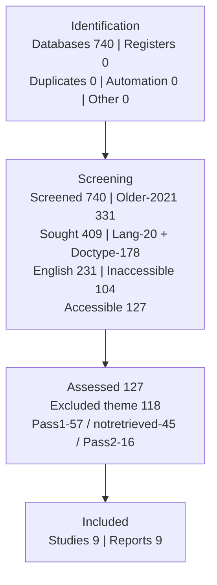

# PRISMA Flow Diagram — Identification of studies via databases and registers

> Query resmi (Scopus, 30 Sep 2026): Q-RAW v6 4-blok + PUBYEAR 2021–2026 + OA/journal/English/article → **127**.
> Q-RAW tanpa filter (740) sebagai bukti keluasan. Screening manual.
> Cek aritmetika: 740 = 331+409 ✓ | 409 − 178 = 231 (20 non-English overlap*) ✓ | 231 = 104+127 ✓ | 127 = 118+9 ✓
> *Footnote overlap: 20 non-English tercatat di dalam 178 non-Article (unik 178) — verifikasi screenshot faset [TODO-SHOT].

## Tahap 1: Identification (Identifikasi)

### Proses Utama

| Kotak | n |
|---|---|
| Records identified from: **Databases** (Scopus Q-RAW v6, tanpa filter) | **740** |
| Records identified from: **Registers** | **0** |

### Proses Pengecualian (Records removed before screening)

| Kotak | n | Rincian |
|---|---|---|
| Duplicate records removed | **0** | Cek DOI + EID di export: 0 duplikat |
| Records marked as ineligible by automation tools | **0** | Tanpa automation; semua keputusan manual |
| Records removed for other reasons | **0** | Eksklusi via tahap screening di bawah (bukan pra-screening) |

→ **Records screened: 740**

## Tahap 2: Screening (Penyaringan)

### Penyaringan Data

| Kotak | n |
|---|---|
| Records screened | **740** |
| Records excluded older than 2021 | **331** [TODO-SHOT faset] |

### Pencarian Laporan

| Kotak | n | Rincian |
|---|---|---|
| Reports sought for retrieval | **409** (= 740 − 331) | Lanjut filter bahasa/tipe/akses |

### Pengecualian Bahasa & Tipe

| Kotak | n | Rincian |
|---|---|---|
| Records Exclude — Language: Non-English | **20*** | *Overlap di dalam 178 (unik 178) [TODO-SHOT] |
| Records Exclude — Document type: Non-Article | **178** | Conference/chapter/review [TODO-SHOT] |
| English-language articles | **231** (= 409 − 178) | — |

### Akses Laporan

| Kotak | n | Rincian |
|---|---|---|
| Records inaccessible | **104** | Paywall/gateway mati [TODO-SHOT] |
| Fully accessible records | **127** (= 231 − 104) | = hasil query resmi 127 ✓ |

### Penilaian Kelayakan Laporan

| Kotak | n | Rincian |
|---|---|---|
| Reports assessed for eligibility | **127** | Title/abstract + full-text (Pass-1 127: 57 excluded E1 21/E2 20/E3 16 → 70 sought Batch-1 28 + Batch-2 42; Pass-2: 4 E5 + 16 excluded → detail `screening_work.csv`) |

### Laporan Dieksklusi (Record excluded based on theme, title, abstract, subject specific)

| Kotak | n |
|---|---|
| Reports excluded (total) | **118** (= 127 − 9) |
| Reason 1 — Pass-1 E1 off-topic no-transfer | 21 |
| Reason 2 — Pass-1 E2 bukan-sensor | 20 |
| Reason 3 — Pass-1 E3 no-method | 16 |
| Reason 4 — Not retrieved/standby (E5 4 + Batch-2 standby 41) | 45 |
| Reason 5 — Pass-2 full-text (E3 4 / E2 2 / E4 2 / E1 1 / backup 7) | 16 |

## Tahap 3: Included (Inklusi)

### Hasil Akhir

| Kotak | n | Rincian |
|---|---|---|
| Studies included in review | **9** | No.61, 77, 14, 60, 79, 131, 80, 12 + No.161 (syarat ≥ 8 TERLAMPUI) |
| Reports of included studies | **9** | 1 study = 1 report |

## Diagram ASCII (salin ke Word)

```
┌─────────────────────────────────────────────────────────────────┐
│ TAHAP 1: IDENTIFICATION                                         │
│ Identification of studies via databases and registers           │
│  Records identified from Databases : n = 740                    │
│  Records identified from Registers : n = 0                      │
│  Records removed before screening:                              │
│   - Duplicate records removed                    : n = 0        │
│   - Marked as ineligible by automation tools     : n = 0        │
│   - Removed for other reasons                    : n = 0        │
│  → Records screened: n = 740                                   │
└──────────────────────────────┬──────────────────────────────────┘
                               ▼
┌─────────────────────────────────────────────────────────────────┐
│ TAHAP 2: SCREENING                                              │
│  Records screened                     : n = 740                 │
│  Records excluded older than 2021     : n = 331                 │
│  Reports sought for retrieval         : n = 409 (= 740 - 331)   │
│  Records Exclude:                                               │
│   - Language Non-English              : n = 20*                 │
│   - Document type Non-Article         : n = 178*                │
│  English-language articles            : n = 231                 │
│  Records inaccessible                 : n = 104                 │
│  Fully accessible records             : n = 127 (= 231 - 104)   │
│  Reports assessed for eligibility     : n = 127                 │
│  Record excluded (theme/title/abstract): n = 118 (= 127 - 9)    │
│   (Pass-1 57 / notretrieved+standby 45 / Pass-2 16)             │
│  *20 overlap di dalam 178 (unik 178)                            │
└──────────────────────────────┬──────────────────────────────────┘
                               ▼
┌─────────────────────────────────────────────────────────────────┐
│ TAHAP 3: INCLUDED                                               │
│  Studies included in review     : n = 9 (= 127 - 118)           │
│  Reports of included studies    : n = 9                         │
└─────────────────────────────────────────────────────────────────┘
```


