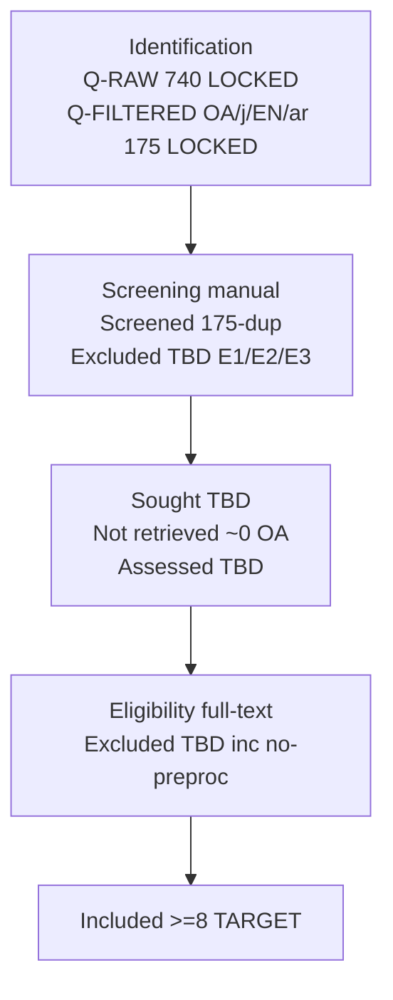

# PRISMA Restart v6 — Terkunci 740 → 175 (OA-only, Tanpa Rayyan)

> Status: **TERKUNCI** 30 Sep 2026. Report lama dihiraukan (sesuai instruksi restart).
> Dataset: Utah FORGE Well 56-32, 1-sec, 2.506.360 baris, 22 kolom → 8 sensor utama.
> Alasan OA-only: full paper wajib dibaca → `LIMIT-TO(OA,"all")` disengaja, bukan cherry-picking.
> Screening: **manual spreadsheet** (tanpa Rayyan).

---

## 0. Query terkunci (copy-paste persis, JANGAN diubah)

### Q-RAW — 740 documents found (tanpa filter, bukti keluasan 500+)

```text
TITLE-ABS-KEY((geothermal OR drill* OR wellbore* OR borehole* OR rig OR "rate of penetration" OR "weight on bit" OR "rig state*" OR petro* OR "oil and gas") AND ("time series" OR "time-series" OR temporal OR multivariate OR sensor* OR "sensor data" OR "sensor signal*" OR "high-frequency" OR unlabeled) AND (clust* OR "k-means" OR "k means" OR "fuzzy c-means" OR DBSCAN OR GMM OR "gaussian mixture" OR "k-shape*" OR "pattern recognition" OR "anomaly detection") AND (normali* OR scal* OR preprocess* OR "feature extraction" OR "feature engineering" OR "sliding window*" OR outlier* OR denoising))
```

- Hits: **740 [TERKUNCI]**. Format rapi (wildcard `*` = ganti ≥1 karakter):
```text
TITLE-ABS-KEY(
  (
    geothermal OR drill* OR wellbore* OR borehole*
    OR rig OR "rate of penetration" OR "weight on bit" OR "rig state*"
    OR petro* OR "oil and gas"
  )
  AND
  (
    "time series" OR "time-series" OR temporal OR multivariate
    OR sensor* OR "sensor data" OR "sensor signal*"
    OR "high-frequency" OR unlabeled
  )
  AND
  (
    clust* OR "k-means" OR "k means" OR "fuzzy c-means"
    OR DBSCAN OR GMM OR "gaussian mixture" OR "k-shape*"
    OR "pattern recognition" OR "anomaly detection"
  )
  AND
  (
    normali* OR scal* OR preprocess*
    OR "feature extraction" OR "feature engineering"
    OR "sliding window*" OR outlier* OR denoising
  )
)
```

### Q-FILTERED — 175 documents found (pool screening resmi)

```text
TITLE-ABS-KEY((geothermal OR drill* OR wellbore* OR borehole* OR rig OR "rate of penetration" OR "weight on bit" OR "rig state*" OR petro* OR "oil and gas") AND ("time series" OR "time-series" OR temporal OR multivariate OR sensor* OR "sensor data" OR "sensor signal*" OR "high-frequency" OR unlabeled) AND (clust* OR "k-means" OR "k means" OR "fuzzy c-means" OR DBSCAN OR GMM OR "gaussian mixture" OR "k-shape*" OR "pattern recognition" OR "anomaly detection") AND (normali* OR scal* OR preprocess* OR "feature extraction" OR "feature engineering" OR "sliding window*" OR outlier* OR denoising)) AND (LIMIT-TO(OA,"all")) AND (LIMIT-TO(SRCTYPE,"j")) AND (LIMIT-TO(LANGUAGE,"English")) AND (LIMIT-TO(DOCTYPE,"ar"))
```

- Hits: **175 [TERKUNCI]**. Filter: OA all (wajib akses full-text) + SRCTYPE journal + English + DOCTYPE article.
- Kalimat paper: *"Pencarian awal tanpa filter menghasilkan 740 dokumen; setelah filter open-access, jurnal, English, article tersisa 175 untuk screening."*

---

## 1. Dataset → penyakit → kata kunci (identifikasi ulang)

| Penyakit (`tugas.txt`) | Bukti dataset 56-32 (Colab 30 Sep 2026, sampel 200k, seed 42) | Blok query yang menangkapnya |
|---|---|---|
| Scale disparity | Range ROP 10.771 vs Torque 41.6 → **rasio 258.9:1** (>100:1 = Euclidean collapse tanpa scaler). SPP mean 1.209 vs Torque mean 2.15. Skew ROP **37.63**, WOB 2.10, Torque 1.89 (ekor kanan ekstrem) | Blok-4 `normali* OR scal* OR preprocess*` |
| Temporal dependency (bonus) | Autocorr: SPP lag1 1.000/lag60 0.946; RPM lag1 0.999/lag60 0.928; ROP lag1 0.988/lag60 0.067 → point-based rapuh, wajib window mean/std/delta | Blok-2 `temporal/multivariate/sensor*` + Blok-4 `"sliding window*"` |
| Missing sentinel | `-999.25`: SPP 2.346 (1,17%), Diff Press 2.346 (1,17%), RPM/Torque 39 (0,02%), lainnya ~0%. Catatan: versi Kaggle ini lebih bersih dari laporan lama (37%) — tetap perlakukan sebagai NaN | Blok-4 `outlier* OR denoising` (missing handling) |
| Outlier IQR | ROP 8,65% (lo −28,4/hi 47,4; max 10.771 = spike kalkulasi); Torque 2,29%; WOB 2,25%; RPM 0,71%; Diff Press 0,68%; SPP 0,00% | Blok-4 `outlier* OR denoising` → justifikasi RobustScaler vs Standard + winsorize ROP |
| Kopel fisik (grounding) | SPP–Pump r=**0.925** (hidrolik); RPM–Torque r=**0.747** (rotasi); RPM–SPP r=0.736; Hook–Pump r=0.697; ROP–WOB r=**0.007** (nonlinier granit — butuh rezim, bukan regresi linier) | Blok-1 domain drilling |
| Anomali Diff Press | Mean **−692** (negatif!), skew −1.21, min −5.138/max 5.115 → kolom bermasalah, kandidat **drop/pisahkan** dari 8-sensor utama | Keputusan preprocessing Tahap 2 |
| Unlabeled, ≥5 numerik | 8 sensor kontinu, tanpa label klaster; median ROP/WOB/RPM/SPP/Torque = 0 (dominan idle) | Blok-2 `unlabeled` + Blok-3 `clust*/k-means/...` |

## 2. Tujuan cari paper (5 goal — jawab pertanyaan dosen)

1. **Metode clustering yang cocok** (K-Means vs DBSCAN/GMM/Fuzzy/k-shape untuk 2,5M baris Euclidean).
2. **Preprocessing penyembuh penyakit** (scaler, window mean/std/delta, sentinel→NaN, winsorization).
3. **Domain grounding** (rig states: drilling/circulation/tripping/idle untuk tafsir centroid).
4. **Evaluasi & tuning** (elbow untuk k, Silhouette + DBI — dicek di full-text, tidak di query).
5. **Gap positioning** (tabel §5: tiap paper ditulis dataset n/freq/sensor + preprocessing + clustering + evaluasi + gap vs kita).

---

## 3. Screening manual tanpa Rayyan (ganti Rayyan)

File: `screening_template.csv` (satu folder; header siap, 1 baris contoh).

1. Export Scopus 175 → CSV (Title, Authors, Year, Source, Abstract, DOI) → paste ke template.
2. Dedup manual: sort by DOI → isi `Duplicates removed` (ekspektasi 0–5, single source).
3. Pass-1 judul+abstrak (bagi 5 orang, ~35/orang): isi `Decision_Pass1` (Include/Maybe/Exclude) + `Reason_Pass1`.
4. Ambil full-text OA yang Include/Maybe (ekspektasi 25–40) → Pass-2 baca penuh → `Decision_Pass2` → sisakan **≥8**.
5. Semua angka langsung jadi kotak PRISMA §4 (tidak perlu export Rayyan).

### Kriteria inklusi / eksklusi (turunan 4 blok)

| Include (lolos jika ≥1 per blok + OA) | Exclude + alasan |
|---|---|
| Domain: geothermal/drilling/wellbore/rig/ROP/WOB/petro ATAU metode jelas transferable ke sensor 1 Hz | E1 Off-topic no-transfer (finance/medis/teks/vision murni) |
| Data: time-series/multivariat/sensor/high-freq/unlabeled | E2 Bukan deret-waktu sensor (tabular statis/teks/gambar saja) |
| Metode: K-Means family + pembanding (DBSCAN/GMM/Fuzzy/k-shape/pattern/anomaly). Supervised = NETRAL, inklusi jika domain sensor / kontras gap | E3 No clustering + no domain link (supervised di-exclude HANYA jika case ini) |
| Preprocessing eksplisit di full-text (scaler/window/missing/outlier) | E4 No preprocessing detail / sintetik murni / editorial / duplikat lolos |

---

## 4. Kotak PRISMA 2020 (isi + contoh konsisten)

| Kotak | n | Status |
|---|---|---|
| Records identified (Q-RAW) | **740 [TERKUNCI]** | Bukti keluasan, 30 Sep 2026 |
| Records after filters (Q-FILTERED, screened) | **175 [TERKUNCI]** | Pool screening (`screening-175paper.csv`, 175 baris terverifikasi) |
| Duplicate records removed | **0 [FAKTUAL]** | Cek DOI + EID di export: 0 duplikat, 0 DOI kosong |
| Records marked as ineligible by automation | **0** | Tanpa Rayyan/auto-exclude, semua manual |
| Records removed for other reasons | 0 | — |
| Records screened (title/abstract) | **175** (dup 0) | File kerja: `screening_work.csv` (urut prioritas) |
| Records excluded — Older than 2021 | **48 [FAKTUAL]** | Tahun ≤2020 di export (2020:11, 2019:6, 2018:8, 2017:6, 2016:4, ≤2015:13). Q-FILTERED tanpa filter PUBYEAR → eksklusi tahun di screening |
| Sisa untuk Pass-1 judul/abstrak | **127** (= 175 − 48) | Sinyal bantu (bukan keputusan): domain 171/175, method 123/175, preproc 98/175, offtopic-flag ~10–14 |
| Records excluded (Pass-1, dari 127) | **57 [PASS-1 SELESAI]** → E1 off-topic 21 / E2 bukan-sensor 20 / E3 no-method+no-link 16 | `screening_work.csv` kolom Decision/Reason = AI-Pass1 |
| Reports sought for retrieval | **70** (= 127 − 57) → Include 55 + Maybe 15 | `sought_list.csv`, retrieval BERTAHAP (di bawah) |
| Retrieval Batch 1 (direct-domain) | **28** (22 Include + 6 Maybe: drill/geothermal/wellbore/rig/petro/oil-gas) | Diambil + dinilai full-text DULUAN |
| Retrieval Batch 2 (transferable, conditional) | **42** (industri umum: kompresor/boiler/turbin/dll.) | Diambil HANYA jika Batch 1 menghasilkan <8 eligible |
| Reports not retrieved (Batch 1) | **4 [PASS-2 SELESAI]** → alasan E5 (full-text tak dapat diakses) | Semua OA tapi 4 link/gateway gagal |
| Reports assessed (full-text, Batch 1) | **24** (= 28 − 4 E5) | Cek preprocessing KETAT |
| Reports excluded (Pass-2, dari 24) | **16** → E3 no-method-link 4 / E2 bukan-sensor 2 / E4 no-preprocessing 2 / E1 off-topic 1 / backup-sufficiency 7 | 7 backup eligible tapi tersisih prioritas (daftar di bawah) |
| Reports assessed (full-text, Batch 2 conditional) | **1** (No.161, pemicu: penguat k-Means) | Lolos → Included |
| Studies included | **9 [TERKUNCI]** (No.61, 77, 14, 60, 79, 131, 80, 12 + No.161) | 1 study = 1 report |

### Hasil Pass-2 riil Batch 1: 28 → 8 (30 Sep 2026, full-text OA)

```
28 sought Batch-1 → Not retrieved E5 4 → Assessed 24
24 → Excluded 16 (E3 4 / E2 2 / E4 2 / E1 1 / backup-sufficiency 7) → Included 8
Batch-2 conditional: 1 retrieved (No.161, pemicu penguat k-Means) → Assessed +1 → Included +1
FINAL: Assessed 25 (24+1) → Excluded 16 → Included 9 (syarat ≥8 TERLAMPUI)
Cek: 28 = 4+24 ✓ | 25 = 16+9 ✓ | 70 sought = 25 assessed + 4 E5 + 41 standby ✓
Alur penuh: 740 raw → 175 filtered → 48 older-than-2021 → 127 abstrak → 57 excluded (E1 21/E2 20/E3 16)
  → 70 sought (Batch-1 28 + Batch-2 42) → Batch-1: 4 E5 + 16 excluded + 8 included → Batch-2: 1 retrieved + 1 included ✓
Batch 2 sisa (41) standby — sufficiency tercapai (9 ≥ 8).
```

### 9 inklusi final [TERKUNCI] (slot: domain + metode + preprocessing + evaluasi)

| 9 | No.161 Clustering analysis for predictive maintenance of oil wells in Kazakhstan (2026) | >3 jt entri 2 thn harian oil/liquid/water-cut | normalization, outlier handling, correlation | K-means, Elbow K=10 | Elbow + stabilitas 70% | Jangkar k-Means ke-2 + Elbow. Gap: agregat harian, tanpa scaler×window → kita 1 Hz + scaler×window. Catatan DOI: redirect doi.org inkonsisten, terverifikasi repositori Satbayev + Scopus 105034863083 |

### 8 inklusi Batch-1 [TERKUNCI] (tabel di bawah; No.161 di atas sebagai penguat Batch-2)

| # | Paper | Dataset | Preprocessing | Clustering | Evaluasi | Peran/Gap vs kita |
|---|---|---|---|---|---|---|
| 1 | No.61 Feature-based time series clustering, geothermal Wairakei (2026) | Plant temp/flow series | 13/1588 fitur self-supervised selection | 9 algos: k-Means/MeanShift/GMM/DBSCAN | SIL 0.66, DBI 0.40 | Paling dekat; gap: single-plant, tanpa studi scaler×window → kita 8-sensor + scaler×window + Sil/DBI |
| 2 | No.77 Drilling parameter optimization, sliding window (2026) | 7.231 sampel 4 sumur: WOB/RPM/torque/flow/ROP | RF imputation, 3S/K-means/LOF fusion, Savitzky-Golay, sliding window | (optimasi RF) | RMSE, akurasi ROP | Gap: supervised optimization → kita regime discovery label-free |
| 3 | No.14 Unsupervised wellbore trajectory deviation (2026) | 1 sumur, 12 log depth-series | Interpolasi, normalisasi, window len-50 | LSTM autoencoder GNN unsupervised | Recon err, P/R/F1/AUC | Gap: depth-series + tanpa banding scaler → kita sensor permukaan 1Hz + studi scaler |
| 4 | No.60 STADe sliding time-windows, oil&gas ICPS (2025) | Wellhead packet traces | Sliding window + fitur periodisitas | STADe vs KNN/IF/LOF | F1 0.97, zero FP | Gap: data paket jaringan, bukan sensor fisik rig → kita sensor fisik |
| 5 | No.79 SSA geothermal steam anomaly (2025) | 9 sumur geothermal, steam 5-menit 14 thn | Butterworth denoise, agregasi NMS | SSA anomaly | F1/ROC/PR | Gap: univariat steam → kita multivariat 8-sensor |
| 6 | No.131 3W Petrobras flow anomaly DNN (2024) | 21 sumur offshore, flow multivariat | ffill missing, standardise, downsample 1 mnt, window-30, SMOTE | DNN anomaly (supervised) | F1 0.97 | Gap: butuh label → kita unsupervised |
| 7 | No.80 Production-profile workflow Permian (2026) | 189 sumur + completion/geologi | Completion-norm, MRMR/VIF/RFE, MDS | RF (segmen via elbow+CH k=2) | Elbow, Calinski-Harabasz, acc 97.5% | Gap: fitur statis + supervised → kita temporal window |
| 8 | No.12 Tool condition monitoring drilling AE (2023) | AE peck drilling SKD61 | CWT time-frequency, deep features | DDM MVG vs CAE segmentation | Anomaly maps | Gap: single-sensor lab → kita multivariat lapangan |

Backup eligible (7, standby jika reviewer minta tambah): No.7 geothermal supervised, No.54 TimeGPT well-log, No.57 shapelet sucker-rod, No.67 reservoir OC-SVM, No.74 borehole VAE, No.143 borehole transfer, No.156 pump vibration.

### Hasil Pass-1 riil 127 → 70 (30 Sep 2026, 4 slice paralel, Aturan §3)

```
Screened 175 (dup 0) → Excluded Older-than-2021 48 → Title/abstract 127
127 → Excluded 57 (E1 21 / E2 20 / E3 16) → Sought 70 (Include 55 + Maybe 15)
Cek: 175 = 48+127 ✓ | 127 = 57+70 ✓ | 70 = 28 Batch-1 + 42 Batch-2 ✓
Sisa TBD (diisi setelah full-text Batch 1): not-retrieved / assessed / excluded-Pass2 / included
```

Sorotan Batch 1 (paling relevan, ambil dulu): No.61 feature-based clustering geothermal, No.77 sliding-window drilling optimization, No.10 stuck-pipe autoencoder drilling, No.14 unsupervised wellbore trajectory deviation, No.60 STADe sliding-window oil&gas, No.79 SSA geothermal steam, No.26 thermal wellbore defects ML.

### Diagram ASCII (salin ke Word)

```
┌──────────────────────────────────────────────────────────────┐
│ IDENTIFICATION                                                │
│ Q-RAW (4 blok, no filter): n = 740 [TERKUNCI]                │
│ Q-FILTERED (OA+j+English+ar): n = 175 [TERKUNCI]              │
│ Duplicates: TBD | Automation: 0 (manual) | Other: 0          │
└──────────────────────────────┬───────────────────────────────┘
                               ▼
┌──────────────────────────────────────────────────────────────┐
│ SCREENING (manual, title/abstract)                            │
│ Screened: 175 (−dup) | Excluded: TBD (E1/E2/E3)               │
│ → Sought: TBD (ekspektasi 25–40)                             │
└──────────────────────────────┬───────────────────────────────┘
                               ▼
┌──────────────────────────────────────────────────────────────┐
│ RETRIEVAL (OA → ekspektasi ≈0 gagal)                          │
│ Sought: TBD | Not retrieved: TBD | Assessed: TBD             │
└──────────────────────────────┬───────────────────────────────┘
                               ▼
┌──────────────────────────────────────────────────────────────┐
│ ELIGIBILITY (full-text, cek preprocessing ketat)              │
│ Assessed: TBD | Excluded: TBD (E1/E2/E3/E4 no-preproc)        │
└──────────────────────────────┬───────────────────────────────┘
                               ▼
┌──────────────────────────────────────────────────────────────┐
│ INCLUDED                                                      │
│ Studies ≥ 8 [TARGET] | Reports = sama                        │
└──────────────────────────────────────────────────────────────┘
```



---

## 5. Kerangka Gap Analysis spesifik (wajib diisi per paper inklusi)

| Paper | Dataset (n, freq, n-sensor) | Penyakit diatasi? | Preprocessing | Clustering | Evaluasi (k/Sil/DBI) | Gap vs kita (8-sensor 1Hz 2,5M + scaler×window) |
|---|---|---|---|---|---|---|
| P1 | | scale? temporal? missing? | scaler? window? missing? | K-Means / pembanding? | elbow? Sil? DBI? | |
| …P8 | | | | | | |

Kontribusi kita (tetap): `StandardScaler vs RobustScaler × window 60s/30s + mean/std/delta, K-Means k=3–6, Silhouette + DBI, pemetaan 4 rezim rig`.

---

## 6. Checklist sebelum submit

- [ ] String Q-RAW + Q-FILTERED persis + tanggal akses + screenshot hits 740 & 175.
- [ ] CSV export 175 + `screening_template.csv` terisi penuh (tiap baris ada decision + alasan).
- [ ] Semua TBD diganti angka nyata + aritmetika `screened = excluded + sought` dst. pas.
- [ ] `Not retrieved ≈ 0` dijelaskan (konsekuensi OA filter).
- [ ] Gap table §5 terisi 6 kolom untuk tiap paper, bukan generik.
- [ ] Deklarasi Gen-AI dilampirkan (`tugas.txt:54`).

*File ini: `reports/01-protokol-prisma/prisma.restart.v6.md`. Pendamping: `screening_template.csv` (satu folder).*
