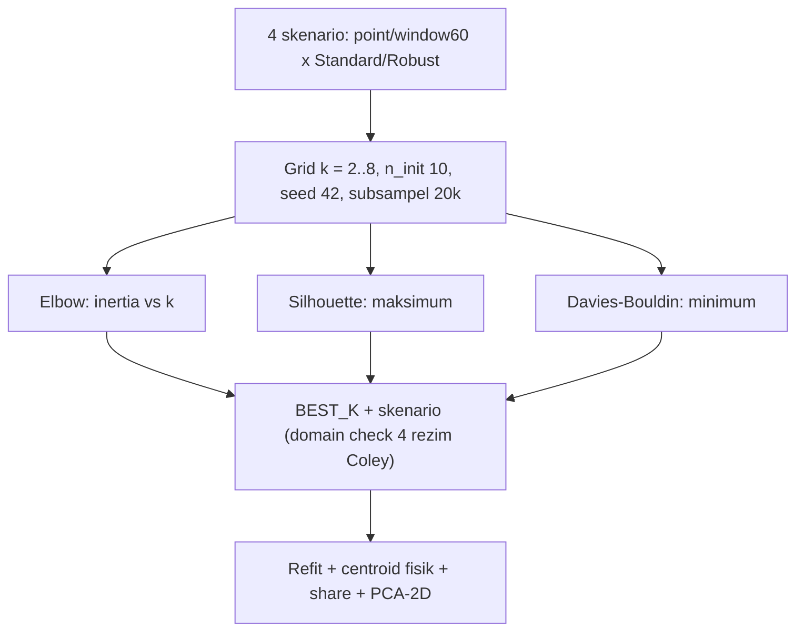

# DRAFT PAPER IEEE (CRISP-DM) — Impact of Feature Scaling and Temporal Window Aggregation on Multivariate Geothermal Drilling Sensor Clustering Using K-Means

> Status: DRAF 30 Sep 2026, two-column IEEE 5–8 hlm + appendix. Struktur: CRISP-DM dipetakan ke
> sistematika tugas (Bab I–IV). Angka [TODO-RERUN]/[TODO-SHOT] diisi setelah re-run Kaggle.
> Diagram PRISMA: `prisma-diagram.drawio` milik tim (Fig. 1) — angka funnel §I-B.

---

## Title

**Impact of Feature Scaling and Temporal Window Aggregation on Multivariate Geothermal Drilling Sensor Clustering Using K-Means**

## Abstract

*Unsupervised monitoring of geothermal drilling rigs requires clustering high-frequency multivariate sensor streams without labels. Following CRISP-DM, we profile the Utah FORGE Well 56-32 dataset (2,506,359 records at 1 Hz, 22 columns → 8 sensors, zero exact duplicates, 2021/02/08–2021/03/09): scale disparity 258.9:1, temporal autocorrelation ≈ 1.0 at lag-1, sentinel −999.25, ROP outliers 8.65%. A PRISMA-guided review (740 → 409 → 231 → 127 → 9 included studies) shows prior work either needs labels, uses single sensors, or ignores scaler–window interaction. We compare StandardScaler vs RobustScaler × point-based vs 60-s sliding-window (mean/std/delta) under K-Means (k = 2–8), selected by elbow and validated by Silhouette and Davies–Bouldin index. Initial runs show RobustScaler dominates (Sil 0.966 vs 0.627), k = 4 selected on domain grounds (four rig regimes); window-vs-point and final centroids await a corrected re-run (ROP winsorized, Diff Press excluded).*

**Keywords:** geothermal drilling; multivariate time series; K-means clustering; feature scaling; sliding window; Silhouette; Davies-Bouldin; Utah FORGE; CRISP-DM.

---

## I. Introduction — CRISP-DM Business Understanding

Manual rig-state logging lags, is subjective, and discontinuous; drilling granite costs tens of
thousands of dollars per day. Tujuan bisnis: regime discovery tanpa label
(drilling, circulation, tripping/connection, idle) + bukti preprocessing yang menyelesaikan
penyakit data (§II-A).

### A. Literature Selection (PRISMA 2020, Fig. 1)

Query resmi (Scopus, 4 blok + PUBYEAR 2021–2026 + OA/journal/English/article → **127**):

```text
TITLE-ABS-KEY((geothermal OR drill* OR wellbore* OR borehole* OR rig OR "rate of penetration"
OR "weight on bit" OR "rig state*" OR petro* OR "oil and gas") AND ("time series" OR "time-series"
OR temporal OR multivariate OR sensor* OR "sensor data" OR "sensor signal*" OR "high-frequency"
OR unlabeled) AND (clust* OR "k-means" OR "k means" OR "fuzzy c-means" OR DBSCAN OR GMM
OR "gaussian mixture" OR "k-shape*" OR "pattern recognition" OR "anomaly detection")
AND (normali* OR scal* OR preprocess* OR "feature extraction" OR "feature engineering"
OR "sliding window*" OR outlier* OR denoising)) AND ... AND PUBYEAR > 2020 AND PUBYEAR < 2027
```

Flow: **740 screened → 331 older-than-2021 → 409 sought → Exclude (Non-English 20* + Non-Article 178*) → 231 English articles → 104 inaccessible → 127 accessible = assessed → 118 excluded (Pass-1 57 + notretrieved/standby 45 + Pass-2 16) → 9 included** (syarat ≥ 8 TERLAMPUI).
Footnote: *20 non-English overlap di dalam 178 (unik 178; 409−178=231 — verifikasi screenshot faset [TODO-SHOT: 331/178/20/104]).
Screening manual, jejak `screening_work.csv`. Fig. 1 = `prisma-diagram.drawio` (export PNG).

### B. Gap Analysis (gaya referensi: Bentuk Data | Preprocessing ± | Clustering ± | Gap)

| Paper | Bentuk Data | Preprocessing (+kelebihan / −kekurangan) | Clustering (+/−) | Gap → kontribusi kita |
|---|---|---|---|---|
| [1] Geothermal clustering, Geothermics 2026 | Time series plant temp/flow | Seleksi 13/1588 fitur self-supervised (+otomatis / −butuh data besar) | 9 algos k-Means/GMM/DBSCAN (+banding adil / −mahal); SIL 0.66, DBI 0.40 | Single-plant, tanpa scaler×window → kita 8-sensor + scaler×window |
| [2] Drilling optimization + window, PLOS ONE 2026 | 7.231 sampel 4 sumur WOB/RPM/torque/flow/ROP | RF imputation, 3S/K-means/LOF, Savitzky-Golay, sliding window (+lengkap / −kompleks) | Optimasi RF supervised (+akurat / −butuh label) | Supervised → kita label-free |
| [3] Wellbore unsupervised AE, Front. AI 2026 | 1 sumur, 12 log depth-series | Interpolasi + normalisasi + window-50 (+sederhana / −fixed-len) | LSTM-GNN unsupervised (+temporal / −mahal) | Depth-series, tanpa banding scaler → kita 1 Hz + studi scaler |
| [4] STADe ICPS, IJ CIP 2025 | Wellhead packet traces | Sliding window + fitur periodisitas (+adaptif / −domain sempit) | STADe vs KNN/IF/LOF (+baseline / −data sintetis) | Data paket, bukan sensor fisik → kita sensor rig |
| [5] Geothermal steam SSA 2025 | 9 sumur, steam 5-mnt 14 thn | Butterworth denoise + NMS (+halus / −tumpul transien) | SSA anomaly (+tanpa label / −univariat) | Univariat → kita multivariat |
| [6] 3W Petrobras DNN 2024 | 21 sumur offshore multivariat | ffill + standardise + downsample + window-30 + SMOTE (+lengkap / −banyak tahap) | DNN supervised, F1 0.97 (+akurat / −butuh label) | Butuh label → kita unsupervised |
| [7] Permian profiles 2026 | 189 sumur + completion | Completion-norm + MRMR/VIF/RFE (+selektif / −statis) | RF + elbow/CH k=2 (+tuning / −supervised) | Fitur statis → kita temporal |
| [8] Drilling AE segmentation 2023 | AE peck drilling lab | CWT time-frequency (+resolusi / −1 sensor) | DDM MVG vs CAE (+banding / −skala lab) | Single-sensor lab → kita lapangan |
| [9] Kazakhstan oil-well K-Means 2026 | >3 jt entri harian oil/liquid/water-cut | Normalization + outlier + korelasi (+ringan / −agregat) | K-means + Elbow K=10 (+murah / −sensitif outlier) | Agregat harian → kita 1 Hz + scaler×window |

### C. Contributions

1. Komparasi StandardScaler vs RobustScaler pada 8 sensor berskala 258.9:1.
2. Agregasi sliding-window 60 s/30 s (mean/std/delta) vs point-based.
3. Regime discovery 4 rezim rig tanpa label (Silhouette + DBI + elbow).

---

## II. Methodology — CRISP-DM Data Understanding, Preparation, Modeling

### A. Data Understanding (karakteristik lengkap — 7 dimensi)

| Dimensi | Hasil ukur (sumber) | Implikasi |
|---|---|---|
| Volume | 2.506.359 baris, 2021/02/08–2021/03/09, 1 Hz | Sampel 60–200k + seed 42 (RAM-safe) |
| Dimensi | 22 kolom → 8 sensor utama (Pason Gas/Gamma 100% sentinel → dibuang) | Syarat ≥5 numerik TERPENUHI |
| Tipe Data | Semua kontinu rasio (ft/hr, klbs, RPM, psi, kft-lb, GPM); 2 kolom waktu; tanpa label | Unsupervised valid |
| Skala Pengukuran | Range ROP 10.771 vs Torque 41,6 → rasio 258.9:1; SPP mean 1.209 vs Torque 2.15 | Wajib scaler (Blok-4 query) |
| Missing Values | Sentinel −999.25: SPP/Diff Press 1,17%, RPM/Torque 0,02%, lainnya ~0% | → NaN + dropna-subset |
| Outlier | ROP 8,65% (max 10.771 artefak), Torque/WOB ~2,3% (stick-slip asli), SPP 0% | Winsorize ROP; RobustScaler |
| Duplikasi | **0 baris duplikat eksak; 0 timestamp ganda** (cek 2.506.359 baris) | Tidak perlu dedup |
| Tambahan | Skew ROP 37,63; median 5 sensor = 0 (idle); Diff Press mean −692/skew −1,21 (kandidat drop); SPP–Pump r=0,925; RPM–Torque r=0,747; ROP–WOB r=0,007; autocorr lag-1 ≈ 1,0 | Window wajib; regime > regresi |

### B. Data Preparation (inventarisasi SEMUA preprocessing — berurutan)

1. **Seleksi kolom:** 22 → 8 sensor (buang Pason Gas, Gamma: 100% sentinel).
2. **Sentinel → NaN:** `-999.25` → NaN (`replace`), bukan angka.
3. **Drop Классик:** `dropna(subset=SENSORS)` — hanya pada sensor yang dimodelkan (hemat baris).
4. **Diff Press OFF:** default 7 sensor; sensitivitas 8 via `USE_DIFF_PRESS = True`.
5. **Winsorize ROP:** clip di HI = Q3+1.5·IQR (≈47) — artefak diredam, bentuk dipertahankan.
6. **Tipe numerik:** `float32` + `datetime` dari 2 kolom waktu + sort kronologis.
7. **Scaling (2 jalur):** StandardScaler (z-score) vs RobustScaler (median–IQR).
8. **Window (2 representasi):** point-based (8 fitur) vs sliding-60 s/stride-30 s → mean/std/delta (24 fitur).
9. **Sampling:** 60–200k + `RandomState(42)`; subsampel 20k untuk metrik; PCA-2D 15k untuk visual.

### C. Modeling — K-Means

Minimasi $J = \sum_{j=1}^{k}\sum_{x_i \in C_j} \lVert x_i - \mu_j \rVert^2$ (Euclidean; Lloyd [S2]).
Grid k = 2–8, n_init = 10, seed 42. Empat skenario: point-standard, point-robust,
window60-standard, window60-robust (kode: notebook fathan cell 24–34).

### D. Evaluation Design (rancangan evaluasi klaster)



Elbow untuk k; **Silhouette** $s(i)$ [S3] (maks) dan **DBI** [S4] (min) sebagai validasi
internal; pembanding [1]: SIL 0.66/DBI 0.40. BEST_K = 4 berbasis domain (elbow datar — jujur).

---

## III. Results — CRISP-DM Evaluation

### A. Data Understanding (RIIL)

§II-A + heatmap korelasi (`fig1`) + boxplot (`fig2`) + trace temporal (`fig4`).

### B. Clustering Experiments (RIIL run awal + [TODO-RERUN])

- Scaler k=4: Robust **0.9658/0.2456** vs Standard 0.6272/0.6253 vs unscaled 0.8973/0.2765.
- Window vs point: point **0.9215** vs window **0.8486** (dilaporkan jujur; tunggu re-run + DBI).
- Elbow (Sil, penuh `../03-sintesis/tahap3_final.md:§3.4`): Robust ≥0.91 semua k; Standard jatuh k≥7.
- Centroid run awal belum fisik (ROP 109 + SPP 0.39) → [TODO-RERUN] centroid/share/PCA pasca-perbaikan.
- Gambar: `fig5` elbow, `fig6` PCA, `fig1/fig2/fig4` — unduh output Kaggle ke `figures/`.

---

## IV. Conclusion and Future Work — CRISP-DM Deployment

Robust scaling menyelesaikan disparitas 258.9:1; regime discovery label-free menutup gap
paper supervised. Window dan centroid final menunggu re-run terkoreksi. Saran: streaming
clustering, GMM/DBSCAN, reintegrasi Diff Press, sampling full-range. [FINALISASI setelah TODO-RERUN.]

---

## References (IEEE)

[1] Feature-based time series clustering for efficient labelling of geothermal data, *Geothermics*, 2026. DOI: 10.1016/j.geothermics.2026.103656.\
[2] Research on an intelligent drilling parameter optimization method using sliding window segmentation, *PLOS ONE*, 2026. DOI: 10.1371/journal.pone.0339324.\
[3] Unsupervised deep learning framework for early detection of wellbore trajectory deviation, *Front. Artif. Intell.*, 2026. DOI: 10.3389/frai.2026.1942787.\
[4] STADe: unsupervised time-windows anomaly detection in oil & gas ICPS, *Int. J. Crit. Infrastruct. Prot.*, 2025. DOI: 10.1016/j.ijcip.2025.100762.\
[5] Anomaly Detection in Geothermal Steam Production Time Series Using SSA, *Eng. Proc.*, 2025. DOI: 10.3390/engproc2025107024.\
[6] Oil and gas flow anomaly detection on offshore naturally flowing wells, *Geoenergy Sci. Eng.*, 2024. DOI: 10.1016/j.geoen.2024.213240.\
[7] ML workflow for classifying production profiles in unconventional reservoirs, *Energy Explor. Exploit.*, 2026. DOI: 10.1177/01445987261433779.\
[8] Tool condition monitoring by anomaly segmentation using AE in small hole drilling, *J. Adv. Mech. Des. Syst.*, 2023. DOI: 10.1299/jamdsm.2023jamdsm0034.\
[9] Clustering analysis for predictive maintenance of oil wells in Kazakhstan, *SOCAR Proc.*, 2026. DOI: 10.5510/OGP20260101153.\
[S1] M. A. Ben Aoun and T. Madarász, ROP prediction Utah FORGE, *Energies*, 2022. DOI: 10.3390/en15124288. (Background, outside PRISMA count.)\
[S2] S. Lloyd, Least squares quantization in PCM, *IEEE Trans. Inf. Theory*, 1982.\
[S3] P. J. Rousseeuw, Silhouettes, *J. Comput. Appl. Math.*, 1987. DOI: 10.1016/0377-0427(87)90125-7.\
[S4] D. L. Davies and D. W. Bouldin, A cluster separation measure, *IEEE TPAMI*, 1979. DOI: 10.1109/TPAMI.1979.4766909.\
[S5] E. Keogh and J. Lin, Clustering of time-series subsequences is meaningless, *Knowl. Inf. Syst.*, 2005. DOI: 10.1007/s10115-004-0172-7.\
[S6] S. Aghabozorgi et al., Time-series clustering — a decade review, *Inf. Syst.*, 2015. DOI: 10.1016/j.is.2015.04.007.

---

## Appendix — lampiran wajib (`tugas.txt:51-54`)

- Fig. 1 = `prisma-diagram.drawio` (export PNG) — funnel §I-A.
- [TODO-SHOT] screenshot faset Scopus: 331 older-than-2021, 178 non-Article, 20 non-English, 104 inaccessible.
- Repo kode + dataset Kaggle (`faruqmahdison/utah-datmin`) + `deklarasi_genai.md` + 6 file jejak screening.
- [TODO-RERUN] centroid/DBI/share + `fig1/fig2/fig4/fig5/fig6` ke `figures/`; konversi .doc two-column.
