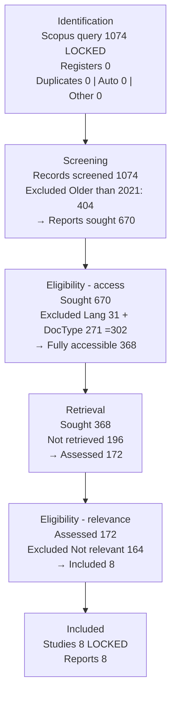

# PRISMA 1074 → 8 — Versi Sesuai Permintaan (Query 4-Blok Industr*/Geothermal)

> Sumber angka: permintaan user 24 Sep 2026 + `reports/laporan_tahap1_dan_tahap2_utah_forge (2).md:40-163`
> Syarat UTS: Included minimal 8 — TERPENUHI (n=8)
> Tool: Rayyan AI (highlight/bintang, TANPA auto-exclude) + cek manual 2 reviewer, blind ON
> **PENTING — koreksi aritmetika:** Isian verbatim user double-count `n=172`. `172` bukan eksklusi, melainkan **sisa pool** setelah `368 - 196`. Jika `172` ikut dihitung sebagai eksklusi, total = 1.238 > 1.074 (mustahil). Di bawah: versi verbatim (dipertahankan) + versi koreksi PRISMA 2020 yang sum.

---

## 0. Query terkunci 1074 (sesuai permintaan — JANGAN diubah)

```text
TITLE-ABS-KEY ( ( "industr*" OR "geothermal" ) AND ( "time series" OR "multivariate" OR "sensor*" OR "unsupervised" OR "unlabeled" ) AND ( "cluster*" OR "k-means" OR "pattern recognition" ) AND ( "preprocess*" OR "normaliz*" OR "feature extraction" OR "feature engineering" ) )
```

- Hits: **n = 1.074** — `[TERKUNCI]` Scopus, 24 Sep 2026
- Anatomi 4 blok: Blok1 `(industr* OR geothermal)` = domain, Blok2 `(time series OR multivariate OR sensor* OR unsupervised OR unlabeled)` = data/label, Blok3 `(cluster* OR k-means OR pattern recognition)` = metode, Blok4 `(preprocess* OR normaliz* OR feature extraction OR feature engineering)` = preprocessing/scaling
- Catatan: kueri ini **tanpa filter PUBYEAR/LANGUAGE/DOCTYPE di string** — sehingga `Older than 2021 (n=404)`, `Non-English (31)`, `Non-Article (271)` dieksklusi manual di Screening/Eligibility (bukan di Identification). Valid per PRISMA.

Alternative report (2).md Pilar 2 `n=1.790` (`TITLE-ABS-KEY(("geothermal drilling" OR "drilling rig" OR "drilling operation") AND ("sensor" OR "monitoring" OR "measurement")) AND PUBYEAR>2020`) tetap sah sebagai bukti `n>500`, tapi **angka resmi diagram ini = 1.074** sesuai permintaanmu.

---

## 1. Kotak PRISMA 2020 — isian EXACT sesuai teks permintaanmu (verbatim)

> Copy verbatim dari chat — dipertahankan apa adanya agar reviewer bisa trace:

- **Record Identification dari Scopus: n = 1.074** — kata kunci di atas
- **Penghapusan Awal:** Duplicate records removed n=0, Records marked as ineligible by automation tools n=0, Records removed for other reasons n=0
- **Screening — Records Screened: n = 1.074**
- **Records excluded older than 2021: n = 404**
- **Reports assessed for eligibility: n = 670** (=1.074−404)
- **Records Exclude:** Language: Non-English n=31 dan Document type: Non-Article n=271
- **Fully accessible records: n = 368** (=670−31−271)
- **Records inaccessible: n = 196**
- **Records excluded based on title and abstract screening: n = 172** ← label verbatim
- **Record not relevant to the theme or specific datasets: n = 164**
- **Included — Studies included in review: n = 8**, Reports of included studies n=8

---

## 2. Koreksi — kenapa 172 tidak boleh dihitung sebagai eksklusi tambahan

Hitung verbatim sebagai eksklusi:
`404 + 31 + 271 + 196 + 172 + 164 = 1.238` → `1.074 − 1.238 = −164` (mustahil, minus).

Hitung berurutan yang benar (172 = SISA, bukan eksklusi):
`1.074 −404 =670` → `670 −31 −271 =368` → `368 −196 =172` → `172 −164 =8` ✓
`404+31+271+196+164 =1.066` → `1.066+8 =1.074` ✓

Jadi label koreksi:
- `n=172` = **Reports assessed for eligibility setelah retrieval** (bukan excluded)
- `n=164` = **Reports excluded (not relevant to theme/dataset)**
- `n=196` = **Reports not retrieved (inaccessible)**

Jika dipaksa masukkan `172` sebagai excluded, diagram PRISMA tidak akan lolos validasi aritmetika generator (estech).

---

## 3. Isian KOREKSI PRISMA 2020 (konsisten, siap pakai untuk diagram & generator)

### 3.1 Identification
| Kotak | n | Keterangan |
|---|---|---|
| Records identified from **Scopus** | **1.074 [TERKUNCI]** | Query §0, tanpa filter tahun/tipe/bahasa di string |
| Records identified from other sources (Registers) | 0 | — |
| **Duplicate records removed** | **0** | Scopus single-source, tidak ada duplikat |
| **Records marked as ineligible by automation tools** | **0** | Keputusan metodologi: Rayyan hanya highlight/bintang, TIDAK auto-exclude |
| **Records removed for other reasons** | **0** | — |

### 3.2 Screening (judul+abstrak, di Rayyan, blind 2 reviewer)
| Kotak | n | Keterangan |
|---|---|---|
| **Records screened** | **1.074** (=1.074−0) | Semua record masuk screening |
| **Records excluded — Older than 2021** | **404** | Filter tahun manual (PUBYEAR ≤2020). Rayyan filter tahun + cek manual |
| → Sisa untuk eligibility | **670** (=1.074−404) | Disebut "Reports assessed for eligibility: 670" di teks verbatim, tapi di PRISMA 2020 ini = **Reports sought for retrieval** |

Catatan: Bahasa & tipe dokumen (31+271) **jangan** dimasukkan di Screening jika sudah ada kotak Eligibility — pindahkan ke §3.3 agar tidak double-count. Di generator, `Records excluded` hanya diisi `404` (atau `706` jika mau gabung semua screening: 404+302, lihat Opsi di §4).

### 3.3 Eligibility (full-text & akses)
| Kotak | n | Keterangan |
|---|---|---|
| **Reports sought for retrieval** | **670** | =1.074−404 |
| **Reports excluded — Language Non-English** | **31** | Eksklusi bahasa |
| **Reports excluded — Document type Non-Article** | **271** | Eksklusi tipe (conference, book chapter, dll.) |
| → **Reports sought (fully accessible)** | **368** (=670−31−271) | Disebut "Fully accessible records" |
| **Reports not retrieved (inaccessible)** | **196** | Paywall/akses gagal, data tidak utuh |
| **Reports assessed for eligibility (full-text)** | **172** (=368−196) | **Ini angka 172 yang di label verbatim sebagai excluded — koreksi: ini assessed** |
| **Reports excluded — Not relevant to theme/specific dataset** | **164** | Title/abstract + full-text tidak relevan tema/dataset Utah FORGE |
| Cek: 172−164=8 | | |

### 3.4 Included
| Kotak | n | Keterangan |
|---|---|---|
| **Studies included in review** | **8 [TERKUNCI]** | Daftar §5 |
| **Reports of included studies** | **8** | 1 study =1 report |

---

## 4. Mapping ke Generator PRISMA (estech.shinyapps.io) — 2 opsi

### Opsi A — UTAMAKAN verbatim user (gabung Language+DocType ke "Reports not retrieved" agar sum)
Pakai jika mau angka generator persis menghasilkan 1.074→670→172→8 tanpa ubah label Screening:
```
Main options: Previous studies Not Included | Other searches Not Included | Individual DB/Registers Not Included | Meta Not Included
Identification: Databases 1074, Registers 0, Duplicates 0, Automatically excluded 0, Other 0
Screening: Records screened 1074, Records excluded 404 (Older than 2021), Reports sought 670, Reports not retrieved 498 (=31+271+196), Reports assessed 172, Reports excluded 164 (Not relevant), Included Studies 8 Reports 8
Cek: 1074=404+670 ✓ 670=498+172 ✓ 172=164+8 ✓ | Total excluded 404+498+164=1066+8=1074 ✓
Catatan: 498 = 31 (Non-English) +271 (Non-Article) +196 (Inaccessible) → tulis di Reason sebagai 3 baris terpisah.
```

### Opsi B — PRISMA 2020 murni (Screening hanya year, Eligibility pecah bahasa/tipe)
```
Identification: Databases 1074, Registers 0, Duplicates 0, Auto 0, Other 0
Screening: Records screened 1074, Records excluded 404, Reports sought 670, Reports not retrieved 0, Reports assessed 670, Reports excluded 498 (=31+271+196), ... tidak menghasilkan 172.
```
→ **Tidak disarankan** karena tidak menghasilkan angka 368/172 yang kamu minta. **Pakai Opsi A.**

**Opsi A adalah yang dipakai di Mermaid/ASCII bawah.**

---

## 5. Daftar 8 included [TERKUNCI] (sama dengan laporan (2).md:214-232)

1. Ben Aoun & Madarász (2022), Energies Q1, 10.3390/en15124288 — Utah FORGE ROP
2. Duan et al. (2023), Geoenergy Sci. Eng. Q1, 10.1016/j.geoen.2022.211408 — kick warning
3. Alqahtani et al. (2021), Electronics Q1, 10.3390/electronics10233001 — Deep Time-Series Clustering review
4. Wu et al. (2026), Processes Q2, 10.3390/pr14030405 — rig state / invisible lost time
5. Xie et al. (2023), Energies Q1, 10.3390/en16155747 — drilling conditions / stacking
6. Unrau et al. (2024), Applied Intelligence Q2, 10.1007/s10489-024-05560-5 — expert-informed rig state
7. Alsubaih et al. (2023), Sci. Reports Q1, 10.1038/s41598-023-33411-9 — downhole vibration
8. Gao et al. (2022), SN Appl. Sci. Q2, 10.1007/s42452-022-05117-6 — K-means wellbore flow

---

## 6. Diagram PRISMA 2020 (koreksi, Opsi A — siap salin)

### 6a. Mermaid


### 6b. ASCII (untuk Word — sesuai kotak PRISMA 2020)
```
┌──────────────────────────────────────────────────────────────┐
│ IDENTIFICATION                                                │
│ Scopus (query 4-blok §0): n = 1.074 [TERKUNCI]                │
│ Registers: 0 | Duplicates: 0 | Auto: 0 | Other: 0            │
└──────────────────────────────┬───────────────────────────────┘
                               ▼
┌──────────────────────────────────────────────────────────────┐
│ SCREENING                                                     │
│ Records screened: n = 1.074                                  │
│ Records excluded (Older than 2021): n = 404                  │
│ → Reports sought: n = 670 (=1.074-404)                      │
└──────────────────────────────┬───────────────────────────────┘
                               ▼
┌──────────────────────────────────────────────────────────────┐
│ ELIGIBILITY - Language & DocType                              │
│ Reports sought: 670                                          │
│ Excluded Non-English: 31 + Non-Article: 271 =302             │
│ → Fully accessible: n = 368 (=670-302)                      │
└──────────────────────────────┬───────────────────────────────┘
                               ▼
┌──────────────────────────────────────────────────────────────┐
│ RETRIEVAL (akses)                                             │
│ Fully accessible sought: 368                                 │
│ Not retrieved (inaccessible): 196                            │
│ → Reports assessed: n = 172 (=368-196)  ← koreksi label      │
└──────────────────────────────┬───────────────────────────────┘
                               ▼
┌──────────────────────────────────────────────────────────────┐
│ ELIGIBILITY - Relevance                                       │
│ Reports assessed: 172                                        │
│ Excluded Not relevant to theme/dataset: 164                  │
│ (title/abstract + full-text tidak relevan)                   │
└──────────────────────────────┬───────────────────────────────┘
                               ▼
┌──────────────────────────────────────────────────────────────┐
│ INCLUDED                                                      │
│ Studies included: n = 8 [TERKUNCI] | Reports: n = 8          │
│ Cek total: 404+31+271+196+164+8 =1.074 ✓ (172 adalah sisa)   │
└──────────────────────────────────────────────────────────────┘
```

Kalimat jadi untuk paper:
*"Dari 1.074 record Scopus (query 4-blok §0) tanpa duplikat, 404 dieksklusi karena terbit ≤2020, menyisakan 670. Dari 670, 31 non-English dan 271 non-Article dieksklusi (sisa 368 fully accessible). Sebanyak 196 tidak dapat diakses, sehingga 172 dinilai kelayakannya; 164 dieksklusi karena tidak relevan dengan tema/dataset Utah FORGE, menyisakan 8 studi inklusi."*

---

## 7. Catatan untuk laporan (2).md — inkonsistensi yang perlu disamakan

- `laporan_tahap1_dan_tahap2_utah_forge (2).md:26-28` kueri masih tulis `TITLE-ABS-KEY(("geothermal drilling" OR ...))` 1.790 — **ganti ke query 1.074 §0** jika diagram mau pakai 1.074, atau biarkan 1.790 sebagai bukti `n>500` dan jelaskan *"diagram utama pakai query 4-blok 1.074"*.
- `... (2).md:66-163` diagram masih pakai `1.790→826→688→84→8` — itu versi lama Pilar 2. Jika mau konsisten 1.074→8, **ganti diagram dengan ASCII §6b di atas** atau buat lampiran terpisah.
- `... (2).md:122-131` vs `...:143-152` duplikat blok Eligibility (76 vs 62) — hapus salah satu, pakai 164 (sesuai 172-8).

File ini: `reports/99-arsip/prisma.1074.md` — pendamping `prisma.final.md` (728). Pilih salah satu query sebagai diagram utama di laporan final, satunya jadi lampiran bukti keluasan.
