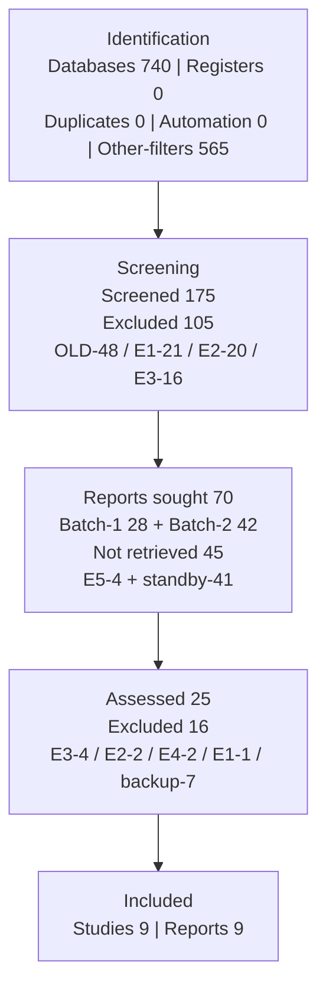

# PRISMA Flow Diagram — Identification of studies via databases and registers

> Query: Q-RAW v6 (740) → Q-FILTERED OA+j+English+ar (175). Scopus, 30 Sep 2026. Screening manual.
> Cek aritmetika: 740 = 565+175 ✓ | 175 = 105+70 ✓ | 70 = 45+25 ✓ | 25 = 16+9 ✓

## Tahap 1: Identification (Identifikasi)

### Proses Utama

| Kotak | n |
|---|---|
| Records identified from: **Databases** (Scopus Q-RAW v6, tanpa filter) | **740** |
| Records identified from: **Registers** | **0** |

### Proses Pengecualian (Records removed before screening)

| Kotak | n | Rincian |
|---|---|---|
| Duplicate records removed | **0** | Cek DOI + EID di export: 0 duplikat |
| Records marked as ineligible by automation tools | **0** | Tanpa automation; semua keputusan manual |
| Records removed for other reasons | **565** | Filter Scopus Q-FILTERED: non-OA/paywall + non-journal + non-English + non-article (= 740 − 175) |

→ **Records screened: 175** (= 740 − 565)

## Tahap 2: Screening (Penyaringan)

### Penyaringan Data

| Kotak | n |
|---|---|
| Records screened | **175** |

### Pengecualian Data

| Kotak | n | Rincian |
|---|---|---|
| Records excluded | **105** | Older-than-2021: 48 (2020:11, 2019:6, 2018:8, 2017:6, 2016:4, ≤2015:13) + E1 off-topic 21 + E2 bukan-sensor 20 + E3 no-method 16 (= 48+21+20+16) |

### Pencarian Laporan

| Kotak | n | Rincian |
|---|---|---|
| Reports sought for retrieval | **70** | Include 55 + Maybe 15 (Batch-1 direct-domain 28 + Batch-2 transferable 42) |

### Laporan Tidak Ditemukan

| Kotak | n | Rincian |
|---|---|---|
| Reports not retrieved | **45** | E5 link/gateway mati 4 + Batch-2 standby 41 (sufficiency tercapai setelah 9 inklusi) |

### Penilaian Kelayakan Laporan

| Kotak | n | Rincian |
|---|---|---|
| Reports assessed for eligibility | **25** | Batch-1 24 + No.161 (Batch-2 conditional) 1 |

### Laporan Dieksklusi

| Kotak | n |
|---|---|
| Reports excluded (total) | **16** |
| Reason 1 — E3: no clustering relevance + no domain link | 4 |
| Reason 2 — E2: not sensor time-series data | 2 |
| Reason 3 — E4: no preprocessing detail (method-slot) | 2 |
| Reason 4 — E1: off-topic confirmed full-text | 1 |
| Reason 5 — Backup-sufficiency: eligible standby (No.7/54/57/67/74/143/156) | 7 |

## Tahap 3: Included (Inklusi)

### Hasil Akhir

| Kotak | n | Rincian |
|---|---|---|
| Studies included in review | **9** | No.61, 77, 14, 60, 79, 131, 80, 12 + No.161 (syarat ≥ 8 TERLAMPUI) |
| Reports of included studies | **9** | 1 study = 1 report |

## Diagram ASCII (salin ke Word)

```
┌─────────────────────────────────────────────────────────────────┐
│ TAHAP 1: IDENTIFICATION                                         │
│ Identification of studies via databases and registers           │
│  Records identified from Databases : n = 740                    │
│  Records identified from Registers : n = 0                      │
│  Records removed before screening:                              │
│   - Duplicate records removed                    : n = 0        │
│   - Marked as ineligible by automation tools     : n = 0        │
│   - Removed for other reasons (filters)          : n = 565      │
│  → Records screened: n = 175 (= 740 - 565)                     │
└──────────────────────────────┬──────────────────────────────────┘
                               ▼
┌─────────────────────────────────────────────────────────────────┐
│ TAHAP 2: SCREENING                                              │
│  Records screened              : n = 175                        │
│  Records excluded              : n = 105                        │
│   (Older-than-2021 48 / E1 21 / E2 20 / E3 16)                  │
│  Reports sought for retrieval  : n = 70 (= 175 - 105)           │
│   (Batch-1 28 + Batch-2 42)                                     │
│  Reports not retrieved         : n = 45                         │
│   (E5 4 + Batch-2 standby 41)                                   │
│  Reports assessed for eligibility : n = 25 (= 70 - 45)          │
│  Reports excluded              : n = 16                         │
│   (E3 4 / E2 2 / E4 2 / E1 1 / backup 7)                       │
└──────────────────────────────┬──────────────────────────────────┘
                               ▼
┌─────────────────────────────────────────────────────────────────┐
│ TAHAP 3: INCLUDED                                               │
│  Studies included in review     : n = 9 (= 25 - 16)             │
│  Reports of included studies    : n = 9                         │
└─────────────────────────────────────────────────────────────────┘
```


